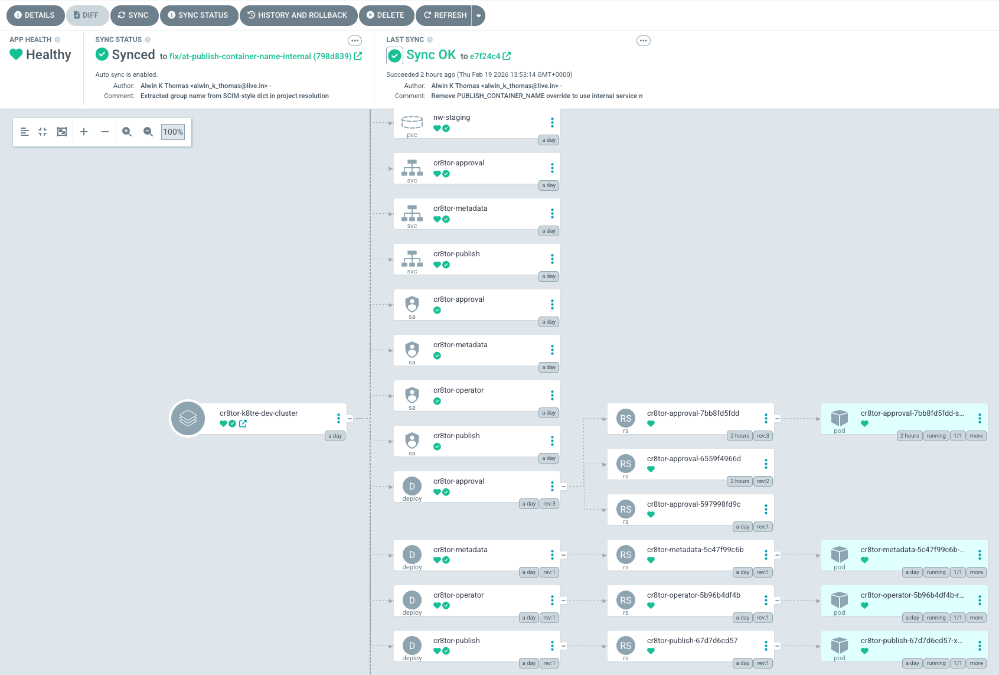
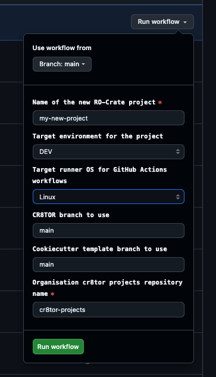
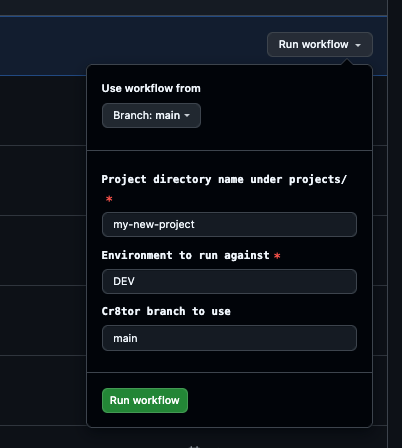

# Deployment Guide

This technical guide will walk TRE operators through the end-to-end setup of cr8tor components required to support automated data ingress, TRE project governance plus the provision of TRE infrastructure resources from a single cr8tor project. In paritcular, this guide will cover the nessasary steps to integrate Cr8tor with Datashield within K8TRE to support federated analysis.   

For TRE operators setting up Cr8tor for the first time, it's first important to understand the core elements that make up Cr8tor and the cannonical metadata model that provides a way of expressing a cr8tor data project that can be used to generate 5-Safes RO-crate artefacts and custom resource (CR) definitions that outline TRE resources (e.g. Opal project and resources) a federated data project requires.

 - [Archtecture & Components](architecture.md)
 - [Cr8tor Metamodel](metamodel.md) 

## QuickStart
This guide assumes you are setting up Cr8tor to work within [K8TRE](https://docs.k8tre.org)

### **K8TRE Installation**
To install K8TRE into a supported Kubernetes (K8s) distribution (e.g. AKS, K3s) follow the setup guide provided [here](https://docs.k8tre.org/latest/guides/installation/).

#### Cr8tor
By default K8TRE deploys cluster-side Cr8tor components as a K8TRE 'app' that installs the [Cr8tor Operator](XX) along with supporting microservices (approvals, publish) that support data validation and movement operations. Verify that Cr8tor application is deployed and associated resources running within your target cluster from terminal:

```bash
kubectl get pods -n cr8tor

NAME                                   READY   STATUS
pod/cr8tor-approval-7bb8fd5fdd-s7wvt   1/1     Running   
pod/cr8tor-metadata-5c47f99c6b-kghnk   1/1     Running   
pod/cr8tor-operator-5b96b4df4b-rfrps   1/1     Running   
pod/cr8tor-publish-67d7d6cd57-xpf2b    1/1     Running   
```

You should see running pods for each Cr8tor microservice and operator. Alternatively, access the ArgoCD portal and view the Cr8tor app:



#### Datashield

To process a data federation Cr8tor project within the target K8TRE, the Datashield application must be available in the cluster. Federation specific K8TRE applications are deployable through a separate 'federation' app-of-apps argocd project. To install Datashield:

1. Clone the federation app-of-apps repository:
```bash
git clone https://github.com/karectl/kare-federation
``` 

2. Apply the federation app-of-apps into the cluster running argocd (this could be the same cluster or dedicated argo management cluster):
```bash
kubectl apply -f ./kare-federation/app-of-apps/federation-app-of-apps.yaml
``` 

Ensure the cluster-side datashield resource pods (Opal, CNPG) are running:
```bash
kubectl get pods -n datashield
NAME                            READY   STATUS
datashield-postgres-cluster-1   1/1     Running
default--10a53cbc               0/1     Running
opal-0                          1/1     Running
```

### **Cr8tor & Github Integration**
The Cr8tor CLI app allows operators to intiaitiate Cr8tor projects and manage the end-to-end workflow of a cr8tor project from the point of DAR request to the publishing of data into Opal. Cr8tor is designed to integrate with github to manage and govern Cr8tor project workflows. 

!!! note
    Cr8tor is not a production service and is currently under active R&D as part of FOCUS-5 Early Adopter project. See our development roadmap for future details.

To deploy Cr8tor for your enterprise:

1. [Create a Github organisation](https://docs.github.com/en/organizations/collaborating-with-groups-in-organizations/about-organizations) linked to your enterprise
2. Clone/fork the [Cr8tor app](https://github.com/karectl-crates/cr8tor) repository into your new github organisation
3. Clone the [Cr8tor projects](https://github.com/karectl-crates/cr8tor-projects) repository template into your new github organisation  
4. Clone the [Cr8tor project cookiecutter template](https://github.com/karectl-crates/cr8-cookiecutter) repository template into your new github organisation 

#### Cr8tor Actions
To manage the creation and transition of a Cr8tor project through each phase of the Cr8tor workflow the Cr8tor app repository includes github actions to initiate (Init RO-Crate Project) and trigger () the processing of a project. These actions require access to the  'approvals' microservice previously deployed into your K8TRE cluster. Add the hostname and API token for the approvals as github action secrets as follows:

```bash
APPROVALS_API_TOKEN_DEV
APPROVALS_HOST_DEV
APPROVALS_API_TOKEN_TEST
APPROVALS_HOST_TEST
```

To get the current approvals service host and API token from your cluster environment run the following:
```bash
kubectl get httproute cr8tor-approval-route -n cr8tor -o jsonpath='{.spec.hostnames[*]}'
kdev get secret cr8tor-microserviceapikey-secret -n cr8tor -o jsonpath='{.data.approvalserviceapikey}' | base64 --decode; echo
```
Note, the current implementation supports two github evnrionments dev and test. If you only have one deployment cluster, just set approvals secrets for DEV.

At this point you have deployed and configured the Cr8tor/Datashield back-end components into your target K8s cluster and all required front-end elements into a github organisation associated with your enterprise. Before proceeding we recommend you get familiar with how Cr8tor manages projects [here](architecture.md). 

### Create Cr8tor Project
The Cr8tor CLI app includes a number of commands to trigger each phase of the workflow. For more details on options to create and manage projects, see [here](../user-guide/create-new-dar-project.md). To ensure all components are set up correctly go and create a cr8tor project via the 'Actions' tab on the Cr8tor repository and run the 'Init RO-Crate Project' action:



This will create a cr8tor project in the target 'cr8tor projects' repository you set up in the organisation. The name of the projects repository can be set on the inputs before running the action (e.g. cr8tor-projects). Using this action simply copies the base cookiecutter template of a cr8tor project. You will further need to edit the configuration of the Cr8tor project by creating a new branch on the cr8tor-projects repository and then raising a PR for review.

### Run Cr8tor Project Workflow
Once all required information for the project have been merged, the governance, data transfer and resource provisioning process can be triggered. To do this, go to the cr8tor projects repository 'Actions' tab and select the 'Run Cr8tor Project Workflow' and specify the new of the project you wish to process:



This will begin the workflow of the project. For more details on the workflow phases see [here]().