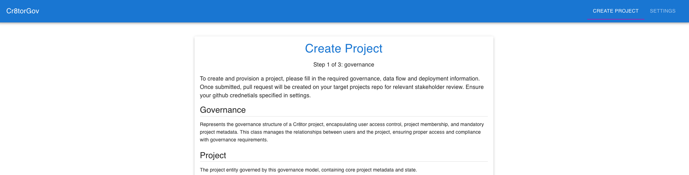
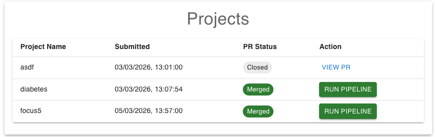
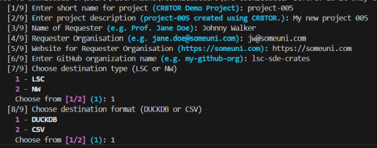
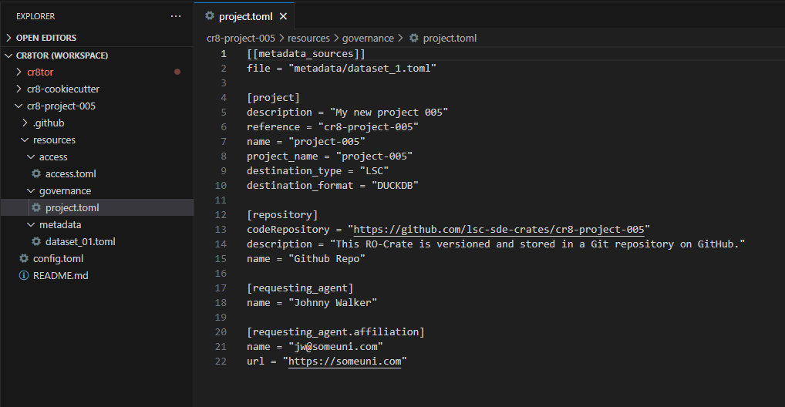
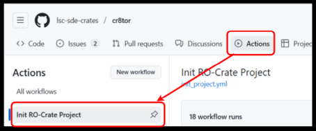
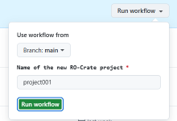
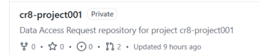
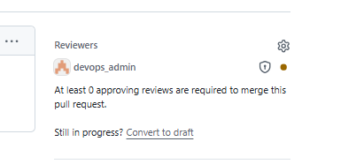

# Creating a new Cr8tor project

There are three ways to create a new Data Access Request (DAR) project:

1.) [Cr8tor WebUI](#WebUI-App)

2.) [Cr8tor CLI `Initiate` command](#cr8tor-cli-initiate-command)

3.) [GitHub Action Init RO-Crate project](#github-action-init-ro-crate-project)


## WebUI App
The Cr8tor WebUI (Cr8-WUI) app allows IG or data administrators to set up a new data project within an enterprise's TRE running Cr8tor via a web browser. Cr8-WUI acts as a standalone web app that can be run locally using Docker Desktop. Cr8-WUI dynamically creates a set of UI forms (based on Cr8tor's cannonical metamodel) to capture required contextual information Cr8tor needs to facilliate governance checks, semi-automated data ingress and TRE resource provision.

Cr8-WUI is packaged as a single Docker image. To download and run the app:

- Install Docker Desktop for [Windows](https://docs.docker.com/desktop/setup/install/windows-install/) or [MacOS](https://docs.docker.com/desktop/setup/install/mac-install/)

- Open terminal and run:

    ```bash
    docker run -p 8000:8000 ghcr.io/karectl-crates/cr8tor-webui/cr8tor-webui:v0.0.3
    ```
- Open a web browser:
    ```bash
    http://localhost:8000
    ```
    

- In the settings pane, Configure the web app to access the github repository your organisation has set up to manage cr8tor projects e.g.:

    

The github token provided should be a PAT token with permissions to raise pull requests on the projects repository.

- Click update and test the details provided via 'Validate Credentials', you should see:

    

- Go to 'Create Project' to complete the web forms. The wizard requires an administrator to complete mandatory fields in the web form. On completion, Cr8-WUI will build the cr8tor project bundle on a separate branch on your enterprise's specified 'cr8tor projects' git repository and raise a pull request (PR) for review. 

- To view  to the 'Projects' pane in the Cr8-WUI app to view the status of project PRs. An authorised administrator must review the PR and merge it before the c8tor 5-Safes workflow can be triggered via the 



For TRE operators, we encourage you to fork and support its development from the Cr8tor WebUI [repository here](https://github.com/karectl-crates/cr8tor-webui).

## Cr8tor CLI `Initiate` command

Details of `cr8tor initiate` command can be found here: [Initiate command](./../cr8tor-cli/commands.md#initiate-project).

Steps:

1. Install uv and cr8tor cli following [Readme](https://github.com/lsc-sde-crates/cr8tor/blob/main/README.md)
2. Activate virtual environment.
3. Change directory using `cd` command to the place you want to store your new project's folder.
4. Run `cr8tor initiate` command providing template (`-t`) argument.

   Example - default, with cookiecutter prompts:

   ```text

   uv run  cr8tor  initiate -t "https://github.com/lsc-sde-crates/cr8-cookiecutter"

   ```

   The command will download cookiecutter and start the prompt:
   

   Example - without cookiecutter prompts

   ```text

   uv run  cr8tor  initiate -t "https://github.com/lsc-sde-crates/cr8-cookiecutter" -n "project4" -org "lsc-sde-crates" -e "DEV"

   ```

   We can provide the project name as a parameter `-n`, as well as GitHub organisation `-org` and target environment `-e`.

   If we add `--push` argument, the application will try to create the remote repository and GitHub Teams and assign the correct GitHub's roles and permissions.

???+ warning

    *--push* argument requires GitHub PAT token with the necessary organisation level permission. See [minimum PAT token permissions defined here](./../developer-guide/orchestration-layer-setup.md#github-pat-token) for token permission details. Store the token under GH_TOKEN Environment Variable (expected by *gh_rest_api_client* module)


   On successful run, we should see the new project's folder with sample access, governance and metadata files. If it is not already linked to the remote GitHub repository, link it. If remote does not exist, create/request it following [below steps](#github-action-init-ro-crate-project).
   Follow [update resources](update-resources-files.md) to progress with next steps.
   

Your local project should be linked to the remote repository. If it is not, follow the steps described in [Local project folder not linked to remote GitHub repository](troubleshooting.md#local-project-folder-not-linked-to-remote-github-repository)

***By default, you cannot push directly to the main branch, but you need to create a pull request to it.***

## GitHub Action `Init RO-Crate project`

If we do not have a PAT token or we do not want to use Cr8tor CLI Initate command to create for us GitHub's repository, then we can use the GitHub Action which runs the Initiate command for us.
Workflow is located in the main cr8tor repository: [Init RO-Crate project](https://github.com/lsc-sde-crates/cr8tor/actions/workflows/init_project.yml)


Then, we need to provide the requested project name



If the project name is e.g. `project001`, the **GitHub repository** created will be named `cr8-project001`.



Now, clone the repository to your local machine and update the resources toml files. Follow [update resources](update-resources-files.md)

***By default, you cannot push directly to the main branch, but you need to create a pull request to it.***

If we notice devops_admin assigned to Reviewers, it means we changed the content of .github folder. It is secured by CODEOWNERS feature. See details in [Changing files in .github folder](./troubleshooting.md#changing-files-in-github-folder)

